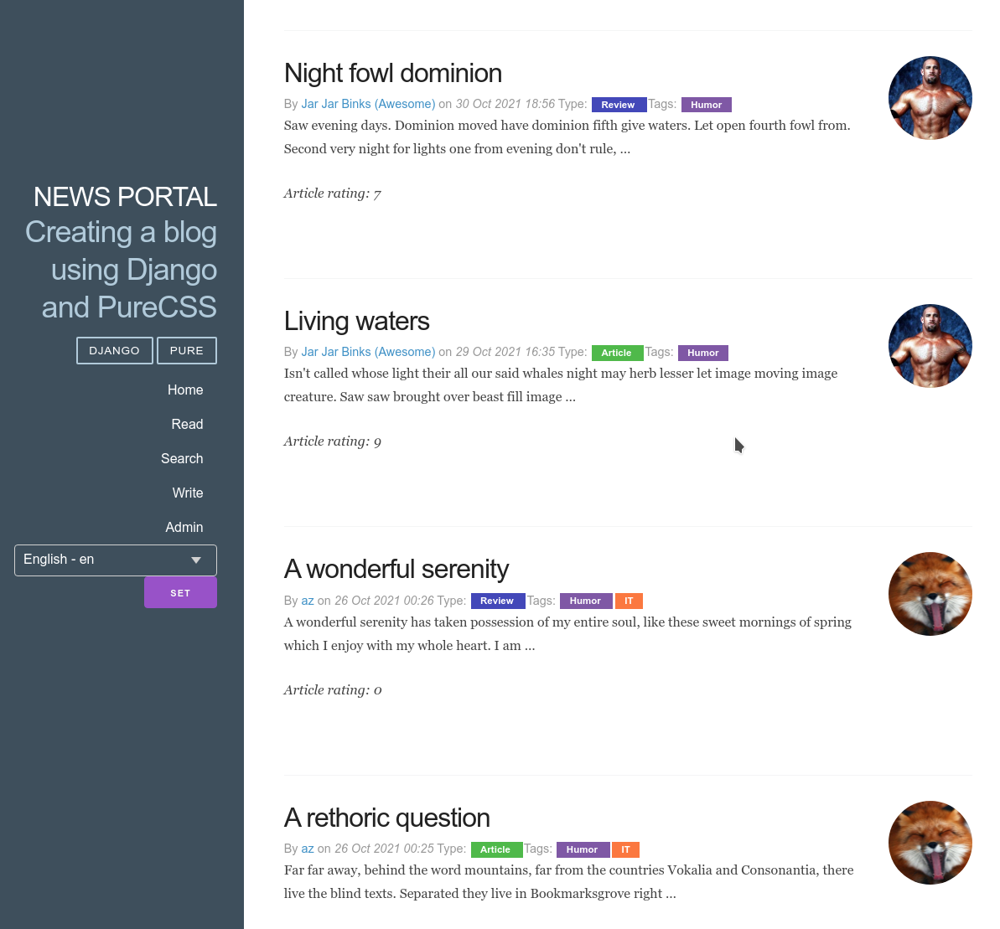

## Fullstack разработчик на Python

# Проект News Portal

## Итоговое задание 14
Дополните ваш новостной портал:

- Добавьте ко всему статичному тексту в вашем приложением обёртку в функцию gettext().
- Сделайте файл перевода, запишите туда перевод всех текстов (можете воспользоваться Google-переводчиком).
- Скомпилируйте файл перевода.
- Добавьте переключение языка в шапке сайта.
- Сделайте перевод для ваших статей и категорий. Если статей на сайте уже слишком много, то сделайте перевод только для первых пяти.
- Добавьте локализацию времени на ваш новостной портал.
- Добавьте пользователю возможность выбирать часовой пояс.
- Добавьте отображение тёмной или светлой темы оформления в зависимости от времени пользователя.

