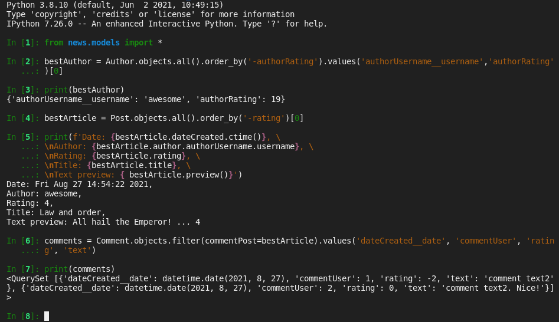

## Fullstack разработчик на Python

#  Модуль D2. Модели 


## Оглавление

[1. Описание проекта](readme.md#Описание-проекта)  
[2. Команды консоли](readme.md#Команды-консоли)  
[3. Скриншот](readme.md#Скриншот)  


## **Проект** *News Portal*. **Итоговое задание**

### Описание проекта    


В ходе этого модуля вы шаг за шагом изучали принципы построения баз данных и создания моделей, а также размышляли над собственным приложением NewsPaper. Итоговое задание этого модуля заключается в создании этого приложения (пока что только моделей).

#### Что в нем должно быть?

1. Модель Author
Модель, содержащая объекты всех авторов.
Имеет следующие поля:

  - cвязь «один к одному» с встроенной моделью пользователей User;
  - рейтинг пользователя. Ниже будет дано описание того, как этот рейтинг можно посчитать.

2. Модель Category
Категории новостей/статей — темы, которые они отражают (спорт, политика, образование и т. д.). Имеет единственное поле: название категории. Поле должно быть уникальным (в определении поля необходимо написать параметр unique = True).

3. Модель Post
Эта модель должна содержать в себе статьи и новости, которые создают пользователи. Каждый объект может иметь одну или несколько категорий.
Соответственно, модель должна включать следующие поля:

  - связь «один ко многим» с моделью Author;
  - поле с выбором — «статья» или «новость»;
  - автоматически добавляемая дата и время создания;
  - связь «многие ко многим» с моделью Category (с дополнительной моделью PostCategory);
  - заголовок статьи/новости;
  - текст статьи/новости;
  - рейтинг статьи/новости.

4. Модель PostCategory
Промежуточная модель для связи «многие ко многим»:

  - связь «один ко многим» с моделью Post;
  - связь «один ко многим» с моделью Category.

5. Модель Comment
Под каждой новостью/статьей можно оставлять комментарии, поэтому необходимо организовать их способ хранения тоже.
Модель будет иметь следующие поля:

  - связь «один ко многим» с моделью Post;
  - связь «один ко многим» с встроенной моделью User (комментарии может оставить любой пользователь, не обязательно автор);
  - текст комментария;
  - дата и время создания комментария;
  - рейтинг комментария.

#### Эти модели должны также реализовать методы:

1. Методы like() и dislike() в моделях Comment и Post, которые увеличивают/уменьшают рейтинг на единицу.

2. Метод preview() модели Post, который возвращает начало статьи (предварительный просмотр) длиной 124 символа и добавляет многоточие в конце.

3. Метод update_rating() модели Author, который обновляет рейтинг пользователя, переданный в аргумент этого метода.
Он состоит из следующего:

  - суммарный рейтинг каждой статьи автора умножается на 3;
  - суммарный рейтинг всех комментариев автора;
  - суммарный рейтинг всех комментариев к статьям автора.

В качестве результата задания подготовьте файл, в котором напишете список всех команд, запускаемых в Django shell.

### Что вы должны сделать в консоли Django?

1. Создать двух пользователей (с помощью метода User.objects.create_user).

2. Создать два объекта модели Author, связанные с пользователями.

3. Добавить 4 категории в модель Category.

4. Добавить 2 статьи и 1 новость.

5. Присвоить им категории (как минимум в одной статье/новости должно быть не меньше 2 категорий).

6. Создать как минимум 4 комментария к разным объектам модели Post (в каждом объекте должен быть как минимум один комментарий).

7. Применяя функции like() и dislike() к статьям/новостям и комментариям, скорректировать рейтинги этих объектов.

8. Обновить рейтинги пользователей.

9. Вывести username и рейтинг лучшего пользователя (применяя сортировку и возвращая поля первого объекта).

10. Вывести дату добавления, username автора, рейтинг, заголовок и превью лучшей статьи, основываясь на лайках/дислайках к этой статье.

11. Вывести все комментарии (дата, пользователь, рейтинг, текст) к этой статье.

Созданное вами приложение вместе с файлом с командами необходимо загрузить в git-репозиторий.

:arrow_up: [к оглавлению](readme.md#Оглавление)
 

## Команды-консоли

### Последовательность команд для проверки ДЗ


```py

cd D2/ # if needed

python3 manage.py shell


from news.models import *

user1 = User.objects.create(username='awesome', first_name='Writer')

Author.objects.create(authorUsername=user1)


user2 = User.objects.create(username='average', first_name='Paperback')
Author.objects.create(authorUsername=user2)


Category.objects.create(name='IT')
Category.objects.create(name='Cooking')

Post.objects.create(author=Author.objects.get(authorUsername=User.objects.get(username='awesome')), categoryType='NWS',  title='Empire strikes back', text='The Sith raise to power and set to conquer the Universe')

Post.objects.create(author=Author.objects.get(authorUsername=User.objects.get(username='awesome')), categoryType='ART',  title='Law and order', text='All hail the Emperor!')

Post.objects.create(author=Author.objects.get(authorUsername=User.objects.get(username='average')), categoryType='ART',  title='The Force is strong', text='Rebels are not ginig up.')


p1 = Post.objects.get(pk=1)
p2 = Post.objects.get(pk=2)
p3 = Post.objects.get(pk=3)

c1 = Category.objects.get(name='IT')
c2 = Category.objects.get(name='Cooking')

p1.postCategory.add(c1)
p2.postCategory.add(c1, c2)
p3.postCategory.add(c2)

Comment.objects.create(commentUser=User.objects.get(username='awesome'), commentPost = Post.objects.get(pk=1), text='comment text1')

Comment.objects.create(commentUser=User.objects.get(username='awesome'), commentPost = Post.objects.get(pk=2), text='comment text2')
Comment.objects.create(commentUser=User.objects.get(username='average'), commentPost = Post.
    ...: objects.get(pk=2), text='comment text2. Nice!')

Comment.objects.create(commentUser=User.objects.get(username='average'), commentPost = Post.objects.get(pk=3), text='comment text3')

Post.objects.get(pk=1).like()
Post.objects.get(pk=1).like()
Post.objects.get(pk=1).like()
Post.objects.get(pk=2).like()
Post.objects.get(pk=2).like()
Post.objects.get(pk=3).dislike()
Post.objects.get(pk=2).like()


Comment.objects.get(pk=1).like()
Comment.objects.get(pk=3).like()
Comment.objects.get(pk=2).dislike()

Author.objects.get(authorUsername=User.objects.get(username='awesome')).update_rating()
Author.objects.get(authorUsername=User.objects.get(username='average')).update_rating()

a1 = Author.objects.get(authorUsername=User.objects.get(username='awesome'))
a1.authorRating
a2 = Author.objects.get(authorUsername=User.objects.get(username='average'))
a2.authorRating


bestAuthor = Author.objects.all().order_by('-authorRating').values('authorUsername__username','authorRating')[0]

print(bestAuthor)

bestArticleId = Post.objects.all().order_by('-rating').values('id')[0]

# print(bestArticleId)

bestArticle = Post.objects.get(id=bestArticleId.get('id'))

print(f'Date: {bestArticle.dateCreated.ctime()}, \
\nAuthor: {bestArticle.author.authorUsername.username}, \
\nRating: {bestArticle.rating}, \
\nTitle: {bestArticle.title}, \
\nText preview: { bestArticle.preview()}')

comments = Comment.objects.filter(commentPost=bestArticle).values('dateCreated__date', 'commentUser', 'rating', 'text')

print(comments)
```
:arrow_up: [к оглавлению](readme.md#Оглавление)

## Скриншот

*Скриншот консоли Джанго:*




:arrow_up: [к оглавлению](readme.md#Оглавление)