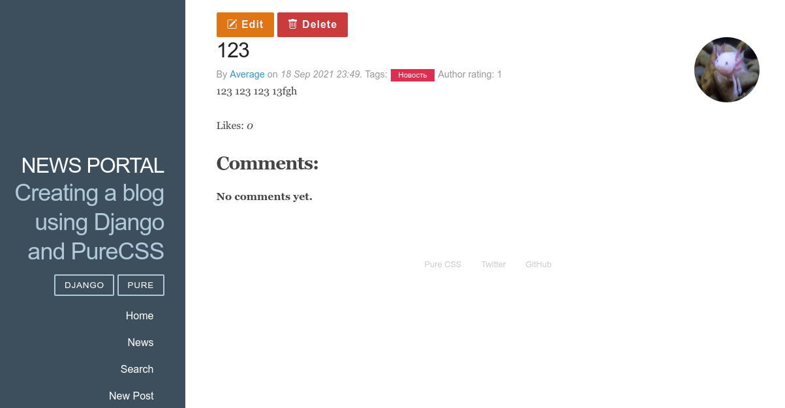

## Fullstack разработчик на Python

# Проект News Portal

Добавьте для группы *authors* права на создание и редактирование объектов модели *Post*, используя панель администратора. В соответствующих представлениях добавьте миксин ограничения прав и в атрибуте класса-представления пропишите, какими правами должен обладать пользователь для доступа к этой странице.

## Итоговое задание

Заключительным шагом изучения темы «Авторизация и регистрация» является продвижение по еще одному этапу создания приложения *News Portal*. В различных частях этого модуля вы получали небольшие задания, которые связаны с его созданием. Для завершения итогового задания вам необходимо загрузить все внесенные изменения в *git*-репозиторий.

Давайте обобщим все действия, которые вы должны выполнить для модификации приложения:

  1. В классе-представлении редактирования профиля добавить проверку аутентификации.
  2. Выполнить необходимые настройки пакета allauth в файле конфигурации.
  3. В файле конфигурации определить адрес для перенаправления на страницу входа в систему и адрес перенаправления после успешного входа.
  4. Реализовать шаблон с формой входа в систему и выполнить настройку конфигурации URL.
  5. Реализовать шаблон страницы регистрации пользователей.
  6. Реализовать возможность регистрации через Google-аккаунт.
  7. Создать группы common и authors.
  8. Реализовать автоматическое добавление новых пользователей в группу common.
  9. Создать возможность стать автором (быть добавленным в группу authors).
  10. Для группы authors предоставить права создания и редактирования объектов модели Post (новостей и статей).
  11. В классах-представлениях добавления и редактирования новостей и статей добавить проверку прав доступа.
  12. Исходный код залить в git-репозиторий.

## Скриншоты

