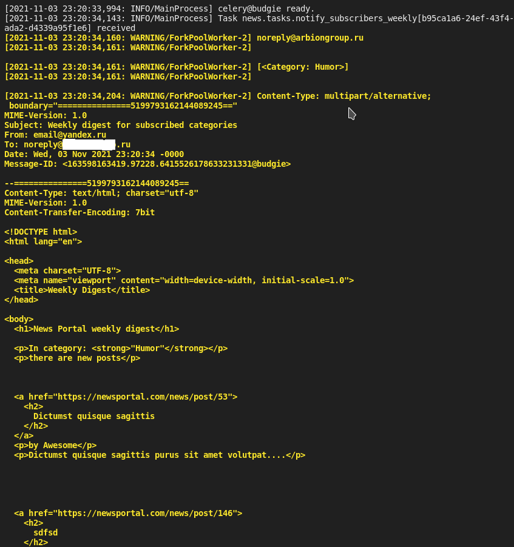

## Fullstack разработчик на Python

# Проект News Portal

Продолжаем работать над проектом новостного приложения. В этом модуле мы, конечно же, добавим работу с асинхронными запросами. Для успешного выполнения этого итогового задания модуля вам необходимо:

1. Установить Redis.
2. Установить Celery.
3. Произвести необходимые конфигурации Django для соединения всех компонент системы.
4. Реализовать рассылку уведомлений подписчикам после создания новости.
5. Реализовать еженедельную рассылку с последними новостями (каждый понедельник в 8:00 утра).

## Решение

Для проверки запустить в терминале команду:

    python3 manage.py runserver

Создать ещё один сеанс в терминале и запустить команду:

    celery -A NewsPaper worker -l INFO -B

В файле celery.py заменить

```py
# 'schedule': crontab(), # Uncomment to test this feature
'schedule': crontab(hour=8, minute=0, day_of_week='monday'),
```

на

```py
'schedule': crontab(), # Uncomment to test this feature
# 'schedule': crontab(hour=8, minute=0, day_of_week='monday'),
```

## Скриншоты


